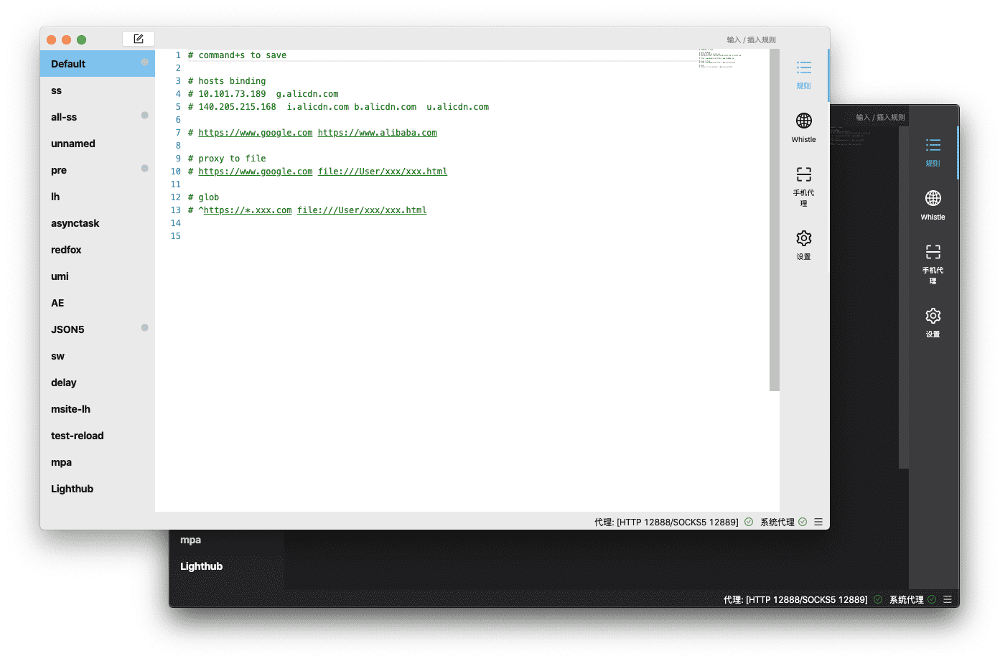

---
nav:
  title: Quick start
  order: 1
order: 1
---

# Quick start

## Download

[** macOS version **](https://gw.alipayobjects.com/os/LightProxy/LightProxy.dmg)

[** Windows version **](https://gw.alipayobjects.com/os/LightProxy/LightProxy-Setup.exe)

## Introduction

LightProxy is a local proxy packet capture software based on `whistle`

## What can LightProxy do for you

-Packet capture, including wireless scene capture
-Real-time `hosts` binding
-Forward resources according to rules
-`mock` interface, page, etc.
-Modify the content of the request and response, for example, insert `script` in the page, modify the return header, etc.

## Installation

After opening `DMG`, drag` LightProxy` to `Application`

## start up

Start `LightProxy` in the application list. The first time you start` LightProxy`, you will be asked for the password twice. This is used to install auxiliary programs and automatically install certificates.

## Use/to quickly insert rules

Click  in the upper left corner to create a new rule, and directly enter `/` to quickly insert the rule

For example, we choose `Mock JSON`

We will complete a `JSON` rule through` snippet`, and we can quickly jump through `Tab`. The usage of `` ES6-like strings '' here is a grammar extended on the basis of `whistle`, which can support multiple lines of content written directly into the rules.

Then we open the browser and visit `https://www.github.com/alibaba/lightproxy`

You can see that the returned content is the `JSON` we wrote. The returned` header` also contains the `my-test-head` that we wrote. At the same time,` __lightproxy-real-url__` and other `header` can also help us quickly locate The actual file.

## More rules

In addition to the multi-line string syntax, `LightProxy` syntax is` whistle` syntax, you can directly refer to the `whistle` rules document: https://wproxy.org/whistle/principle.html](https://wproxy.org/whistle/principle.html)

## Feedback

Feedback `issue` to [https://github.com/alibaba/lightproxy/issues](https://github.com/alibaba/lightproxy/issues)

See WeChat discussion group: [https://github.com/alibaba/lightproxy/issues/93](https://github.com/alibaba/lightproxy/issues/93)

